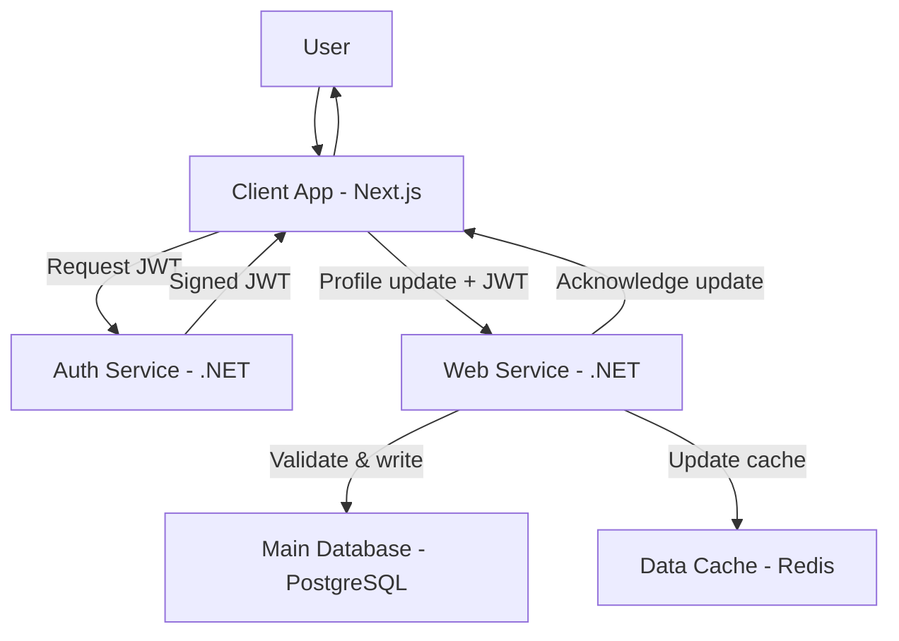

```mermaid
graph TD
    User-->Client[Client App - Next.js]
    Client-- Request JWT -->Auth[Auth Service - .NET]
    Auth-- Signed JWT -->Client
    Client-- Profile update + JWT -->Api[Web Service - .NET]
    Api-- Validate & write -->Postgres[Main Database - PostgreSQL]
    Api-- Update cache -->Redis[Data Cache - Redis]
    Api-- Acknowledge update -->Client
    Client-->User
```
