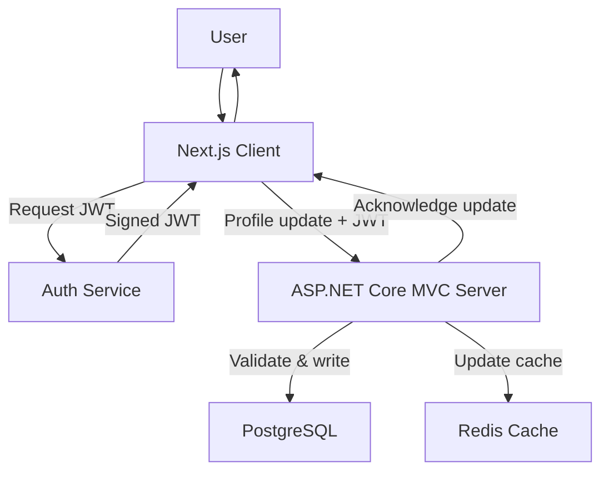

```mermaid
graph TD
    User-->Client[Next.js Client]
    Client-- Request JWT -->Auth[Auth Service]
    Auth-- Signed JWT -->Client
    Client-- Profile update + JWT -->Api[ASP.NET Core MVC Server]
    Api-- Validate & write -->Postgres[PostgreSQL]
    Api-- Update cache -->Redis[Redis Cache]
    Api-- Acknowledge update -->Client
    Client-->User
```
