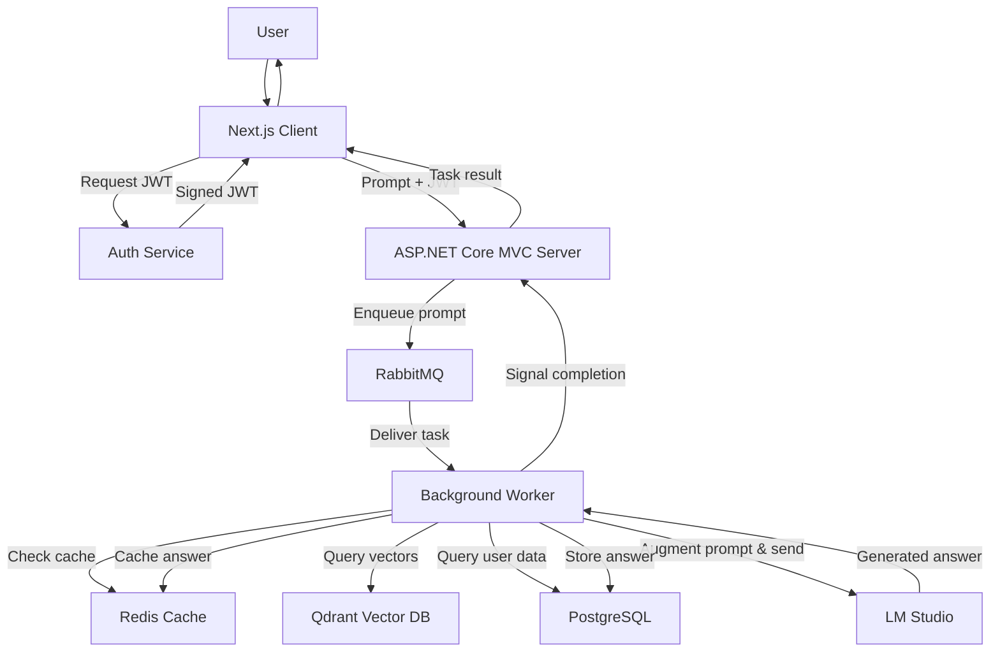

```mermaid
graph TD
    User-->Client[Next.js Client]
    Client-- Request JWT -->Auth[Auth Service]
    Auth-- Signed JWT -->Client
    Client-- Prompt + JWT -->Api[ASP.NET Core MVC Server]
    Api-- Enqueue prompt -->Broker[RabbitMQ]
    Broker-- Deliver task -->Worker[Background Worker]
    Worker-- Check cache -->Redis[Redis Cache]
    Worker-- Query vectors -->Qdrant[Qdrant Vector DB]
    Worker-- Query user data -->Postgres[PostgreSQL]
    Worker-- Augment prompt & send -->LM[LM Studio]
    LM-- Generated answer -->Worker
    Worker-- Store answer -->Postgres
    Worker-- Cache answer -->Redis
    Worker-- Signal completion -->Api
    Api-- Task result -->Client
    Client-->User
```
