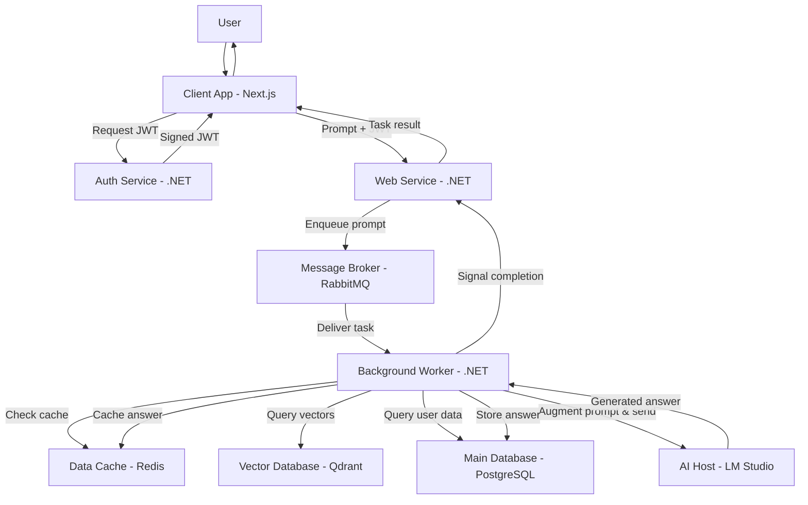

```mermaid
graph TD
    User-->Client[Client App - Next.js]
    Client-- Request JWT -->Auth[Auth Service - .NET]
    Auth-- Signed JWT -->Client
    Client-- Prompt + JWT -->Api[Web Service - .NET]
    Api-- Enqueue prompt -->Broker[Message Broker - RabbitMQ]
    Broker-- Deliver task -->Worker[Background Worker - .NET]
    Worker-- Check cache -->Redis[Data Cache - Redis]
    Worker-- Query vectors -->Qdrant[Vector Database - Qdrant]
    Worker-- Query user data -->Postgres[Main Database - PostgreSQL]
    Worker-- Augment prompt & send -->LM[AI Host - LM Studio]
    LM-- Generated answer -->Worker
    Worker-- Store answer -->Postgres
    Worker-- Cache answer -->Redis
    Worker-- Signal completion -->Api
    Api-- Task result -->Client
    Client-->User
```
